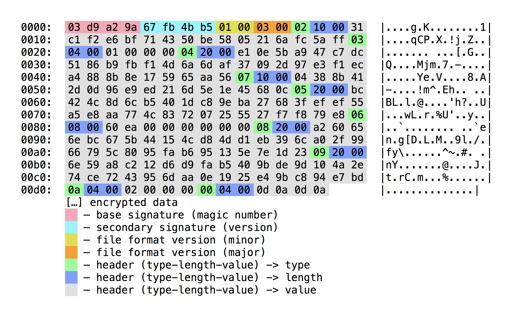

# KDBX — KeepPass File Format   

> KeePass Password Safe is a free and open-source password manager primarily for Windows. It officially supports macOS and Linux operating systems through the use of Mono. Additionally, there are several unofficial ports for Windows Phone, Android, iOS, and BlackBerry devices. KeePass stores usernames, passwords, and other fields, including free-form notes and file attachments, in an encrypted file. This file can be protected by a master password, keyfile, and/or the current Windows account details. By default, the KeePass database is stored on a local file system (as opposed to cloud storage).
>
> — https://en.wikipedia.org/wiki/KeePass

ID     | DataType | Header Name           | Description
-------|----------|-----------------------|------------
`0x00` | `[]byte` | `EndHeader`           | defines the end limit for the headers block
`0x01` | `[]byte` | `Comment`             | is current ignored by KeePass and alternate apps
`0x02` | `[]byte` | `CipherID`            | represents the UUID of the cipher algorithm
`0x03` | `uint32` | `CompressionFlags`    | determines if the database is compressed or not
`0x04` | `[]byte` | `MasterSeed`          | salt to concatenate to the master key
`0x05` | `[]byte` | `TransformSeed`       | seed for AES.Encrypt to generate the master key
`0x06` | `uint64` | `TransformRounds`     | number of rounds to compute the master key
`0x07` | `[]byte` | `EncryptionIV`        | defines the initialization vector of the cipher
`0x08` | `[]byte` | `ProtectedStreamKey`  | used to obfuscate some fields of the decrypted file
`0x09` | `[]byte` | `StreamStartBytes`    | portion of the decrypted database for verification
`0x10` | `uint32` | `InnerRandomStreamID` | algorithm used for individual password obfuscation
